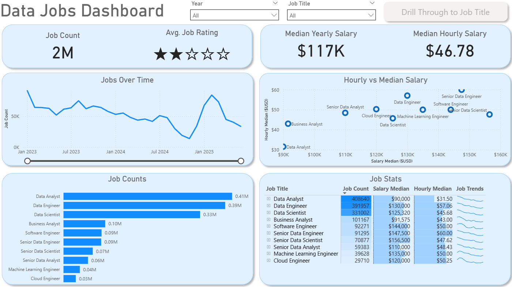
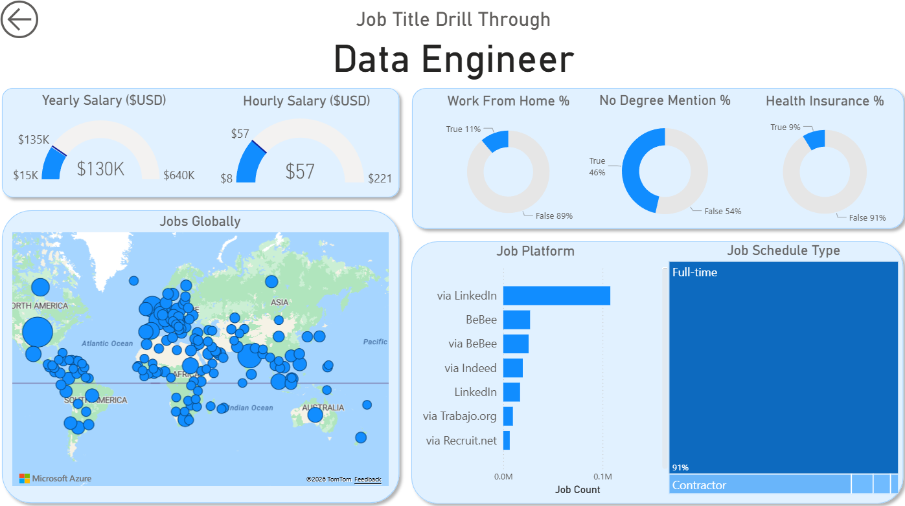
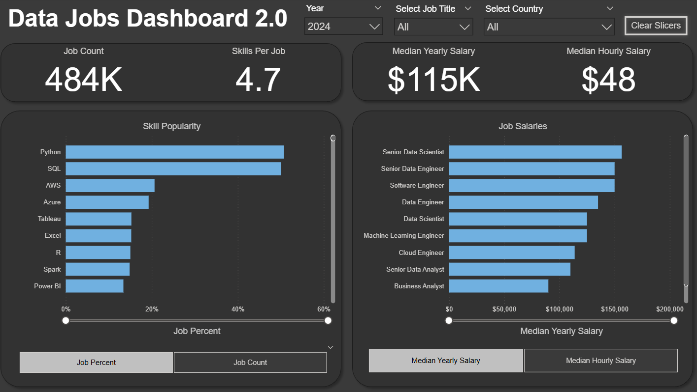

# Data Jobs Postings Dashboards

This repository showcases a set of Power BI dashboards created as part of my learning and portfolio-building process, developed within the [Power BI for Data Analytics](https://www.youtube.com/watch?v=FwjaHCVNBWA&t=9302s) course by [Luke Barousse](https://github.com/lukebarousse) and [Kelly Adams](https://github.com/kellyjadams). The projects illustrate a progression from foundational reporting to more focused analytical design, with an emphasis on turning real-world job market data into clear and actionable insights.

The dashboards are based on a consolidated dataset of real-world job postings spanning **2023, 2024, and the first half of 2025**, including information on job titles, salaries, locations, required skills, and other key employment characteristics. The data was collected and curated by **Luke Barousse** through scraping and aggregation of job postings.

## Featured Dashboards

Below is an overview of the dashboards included in this repository. Each project is documented within its own folder and includes a dedicated README describing the project goals, analytical scope, report structure, modeling decisions, and key Power BI techniques used. Together, the projects illustrate how the analytical approach and report design evolved over time.

## Data Jobs Dashboard (V1 – Comprehensive Exploration)

[**Interactive report (Power BI Service)**](https://app.powerbi.com/view?r=eyJrIjoiNDlhNTBjZDYtODBlZi00NDk1LWE5MTYtYjJjZTBiNzg2OWY2IiwidCI6ImRmODY3OWNkLWE4MGUtNDVkOC05OWFjLWM4M2VkN2ZmOTVhMCJ9)

The first version of the dashboard provides a two-page exploration of the data job market aimed at job seekers. It combines a high-level overview with a drill-through page that enables deeper inspection of individual job titles, salary distributions, and selected market characteristics.

**Power BI skills demonstrated:**

- Dashboard layout and visual composition  
- Working with prepared datasets  
- Standard aggregations and built-in calculations  
- Core visual types (column, bar, line)  
- Geospatial analysis using map visuals  
- KPI cards and detailed tables  
- Interactive slicers for filtering  
- Navigation using buttons and bookmarks  
- Drill-through interactions  

[View full Project 1 documentation](Data_Jobs_V1/README.md)

## Data Jobs Dashboard 2.0 (V2 – Single-Page Focus)

[**Interactive report (Power BI Service)**](https://app.powerbi.com/view?r=eyJrIjoiY2Y4MzQ0YzQtZDFiNi00OGI2LTk5M2ItYzNkMjZlOGI2Y2M0IiwidCI6ImRmODY3OWNkLWE4MGUtNDVkOC05OWFjLWM4M2VkN2ZmOTVhMCJ9)

Version 2.0 refines the analysis into a single-page report designed for fast insight delivery. This iteration emphasizes focused analytical design, dynamic filtering, and parameter-driven comparisons, clearly demonstrating progression in both DAX usage and overall report design.

**Power BI skills demonstrated (advanced concepts):**

- Single-page dashboard design and UX optimization  
- Data transformation with Power Query (ETL)  
- Analytical data modeling with defined relationships  
- Explicit DAX measures and context-aware calculations  
- Parameter-driven analysis and metric switching  
- KPI cards and summary visuals  
- Optimized slicers and cross-filtering behavior  

[View full Project 2 documentation](Data_Jobs_V2/README.md)
